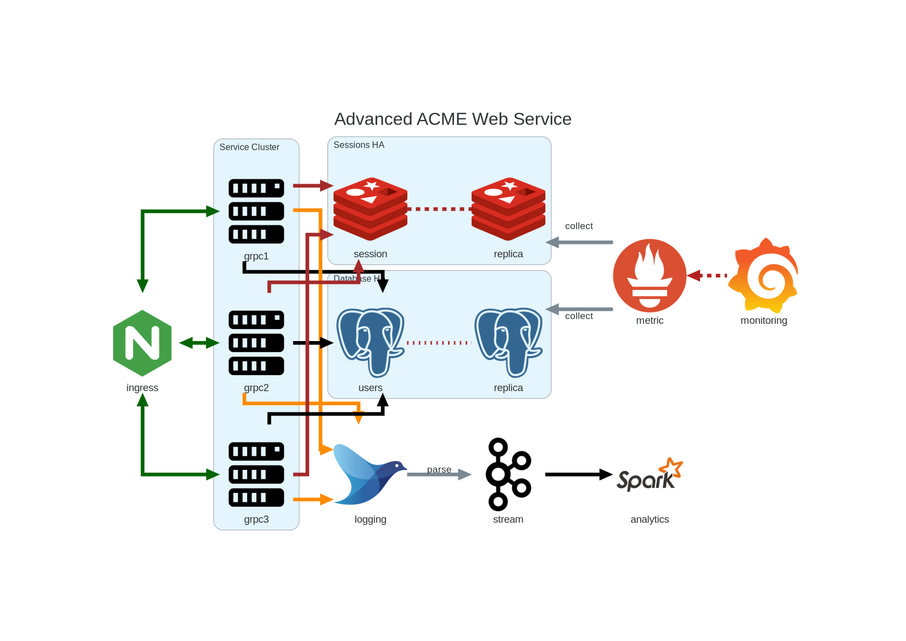

.. class:: title-logobox

.. list-table::
   :widths: 72

   * - |
       |
       |
       | |ACME_logo|

.. |ACME_logo| image:: images/acme.png
   :width: 245
   :height: 84
   :scale: 250

|
|
|
|

.. class:: title-deepbox

.. list-table::
   :widths: 72

   * - .. class:: title-name

       Software Version Description
   * - .. class:: title-name

       ACME Engineering Evaluation Unit

|
|
|

.. class:: title-info

Doc #00001042

.. class:: title-info

Version 0.1

.. class:: title-info

01/31/23

|
|
|

.. class:: title-deepbox

.. list-table::
   :widths: 72

   * - .. class:: title-notice

       THIS DOCUMENT CONTAINS PROPRIETARY AND CONFIDENTIAL INFORMATION INTENDED ONLY FOR LIMITED DISTRIBUTION WITHIN ACME SYSTEMS AND ITS DESIGNEES. IT SHALL NOT BE REPRODUCED OR TRANSFERRED TO OTHER DOCUMENTS OR DISCLOSED TO OTHERS OR USED FOR ANY PURPOSE OTHER THAN THAT FOR WHICH IT WAS OBTAINED WITHOUT THE EXPRESSED WRITTEN CONSENT OF ACME SYSTEMS.

.. contents:: Table of Contents

.. raw:: pdf

   PageBreak

Revisions
=========

Document revision history.

.. list-table::
   :widths: 9 19 11 33
   :header-rows: 1

   * - Revision
     - Author
     - Date
     - Description
   * - 0.1
     - SLA
     - 2024-01-24
     - Initial draft shell

.. raw:: pdf

   PageBreak

1.0 - Scope
===========

1.1 - Identification
~~~~~~~~~~~~~~~~~~~~

This document is the Draft Software Version Description (see revision table)
for the End-user Management Component of the Advanced ACME Web Services Appliance,
Engineering Evaluation Unit.

1.2 - System Overview
~~~~~~~~~~~~~~~~~~~~~

The Advanced ACME Web Services Appliance is an on-premise virtual Web Services
cluster with an advanced management interface.  This document provides both the
Version Description and Installation steps for the Management Console only. The
ACME Web Service high-level system components are shown in Figure 1 below:

   Figure 1. Advanced ACME Web Service Components

The management console consumes monitoring data and summarizes/displays the
analytics from Spark.

1.3 - Document Overview
~~~~~~~~~~~~~~~~~~~~~~~

2.0 Referenced documents
========================

3.0 Version description
=======================

3.1 Inventory of materials released
~~~~~~~~~~~~~~~~~~~~~~~~~~~~~~~~~~~

3.2 Inventory of software contents
~~~~~~~~~~~~~~~~~~~~~~~~~~~~~~~~~~

3.3 Changes installed
~~~~~~~~~~~~~~~~~~~~~~~~

3.4 Adaptation data
~~~~~~~~~~~~~~~~~~~

3.5 Related documents
~~~~~~~~~~~~~~~~~~~~~

3.6 Installation instructions
~~~~~~~~~~~~~~~~~~~~~~~~~~~~~

3.7 Possible problems and known errors
~~~~~~~~~~~~~~~~~~~~~~~~~~~~~~~~~~~~~~

4.0 General information
=======================

This section shall contain any general information that aids in understanding
this document (e.g., background information, glossary, rationale). This section
shall include an alphabetical listing of all acronyms, abbreviations, and their
meanings as used in this document and a list of any terms and definitions needed
to understand this document.

A. Appendixes
=============

Appendixes may be used to provide information published separately for
convenience in document maintenance (e.g., charts, classified data). As
applicable, each appendix shall be referenced in the main body of the document
where the data would normally have been provided. Appendixes may be bound as
separate documents for ease in handling. Appendixes shall be lettered
alphabetically (A, B, etc.).
